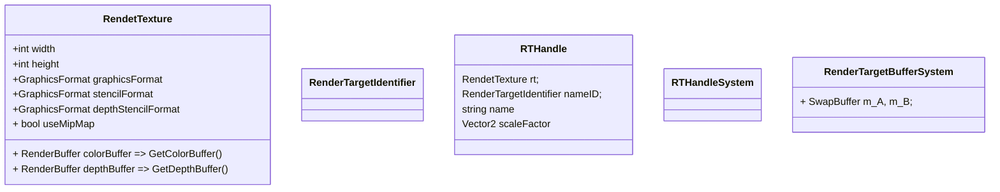

# RT相关



流程

```c#
UniversalRenderPipelineAsset.CreatePipeline()
{
    UniversalRenderPipeline(UniversalRenderPipelineAsset asset)
    {
        //初始化RTHandlesSystem
        RTHandles.Initialize(Screen.width, Screen.height);
	}
    
    UniversalRenderPipelineAsset.CreateRenderers()
    {
		UniversalRenderer(UniversalRendererData data)
        {
            // 双缓冲buffer
            m_ColorBufferSystem = new RenderTargetBufferSystem("_CameraColorAttachment");
        }
    }
}


UniversalRenderPipeline.RenderSingleCameraInternal()
{
    InitializeCameraData()
    {
         cameraData.cameraTargetDescriptor = CreateRenderTextureDescriptor();
    }
    RenderSingleCamera()
    {
        RTHandles.SetReferenceSize(cameraData.cameraTargetDescriptor.width, cameraData.cameraTargetDescriptor.height);
        
        UniversalRenderer.Setup(ScriptableRenderContext context, ref RenderingData renderingData)
        {
            UniversalRenderer.CreateCameraRenderTarget()
            {
                m_ActiveCameraColorAttachment = m_ColorBufferSystem.GetBackBuffer(cmd);
                {
                    m_ColorBufferSystem.ReAllocate(CommandBuffer cmd)
                    {
                        RenderingUtils.ReAllocateIfNeeded(ref m_A.rtResolve, desc, m_FilterMode, TextureWrapMode.Clamp, name: m_A.name);
                    }
                }
                ConfigureCameraColorTarget(m_ActiveCameraColorAttachment);
                {
                    m_CameraColorTarget = new RTHandleRenderTargetIdentifierCompat { handle = m_ActiveCameraColorAttachment };
                }
                
                cmd.SetGlobalTexture("_CameraColorTexture", m_ActiveCameraColorAttachment.nameID);
                cmd.SetGlobalTexture("_AfterPostProcessTexture", m_ActiveCameraColorAttachment.nameID);
                
                RenderingUtils.ReAllocateIfNeeded(ref m_CameraDepthAttachment, depthDescriptor, FilterMode.Point, TextureWrapMode.Clamp, name: "_CameraDepthAttachment");
                cmd.SetGlobalTexture(m_CameraDepthAttachment.name, m_CameraDepthAttachment.nameID); 
            }
            
            m_ActiveCameraColorAttachment = createColorTexture ? m_ColorBufferSystem.PeekBackBuffer() : m_XRTargetHandleAlias;
            m_ActiveCameraDepthAttachment = createDepthTexture ? m_CameraDepthAttachment : m_XRTargetHandleAlias;        
        }
        
        ConfigureCameraTarget(m_ActiveCameraColorAttachment, m_ActiveCameraDepthAttachment);
        {
            m_CameraColorTarget = new RTHandleRenderTargetIdentifierCompat { handle = colorTarget };
            m_CameraDepthTarget = new RTHandleRenderTargetIdentifierCompat { handle = depthTarget };
        }
        
        ScriptableRender.Execute()
        {
            ScriptableRender.InternalStartRendering()
            {
                OnCameraSetup()
                {
                    ConfigureTarget()
                }
            }
            
            pass.Configure(cmd, cameraData.cameraTargetDescriptor);
            {
                
            }
            ScriptableRender.ExecuteRenderPass()
            {
                ScriptableRender.SetRenderPassAttachments(cmd, renderPass, ref cameraData);
                {
                    
                }
            }
        }
    }
}

```

