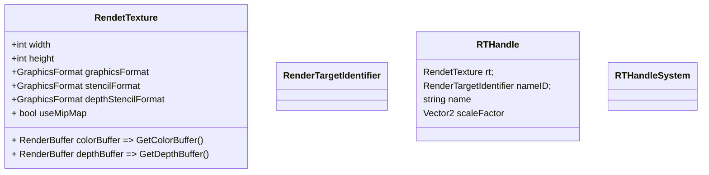

# RT相关



流程

```c#
UniversalRenderPipelineAsset.CreatePipeline()
{
    UniversalRenderPipeline(UniversalRenderPipelineAsset asset)
    {
        RTHandles.Initialize(Screen.width, Screen.height);
	}
    
    UniversalRenderPipelineAsset.CreateRenderers()
    {
		UniversalRenderer(UniversalRendererData data)
        {
            m_ColorBufferSystem = new RenderTargetBufferSystem("_CameraColorAttachment");
        }
    }
}


UniversalRenderPipeline.RenderSingleCameraInternal()
{
    
}

```

