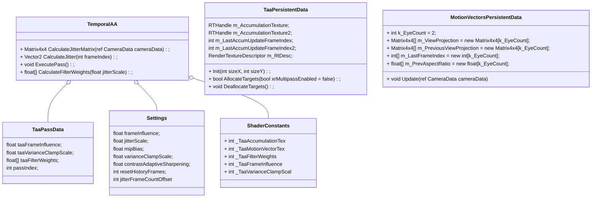

# TAA

#### 类图




#### 整体流程

```c#
UniversalRenderPipeline.RenderSingleCameraInternal()
{
    UniversalRenderPipeline.InitializeCameraData()
    {
        UniversalRenderPipeline.InitializeStackedCameraData()
        {
            cameraData.antialiasing = baseAdditionalCameraData.antialiasing;
            cameraData.antialiasingQuality = baseAdditionalCameraData.antialiasingQuality;
        }
    }
    
    UniversalRenderPipeline.InitializeAdditionalCameraData()
    {
        UniversalRenderPipeline.UpdateTemporalAAData()
        {
            TaaPersistentData.Init(); //创建RenderTextureDescriptor，释放RT
            cameraData.taaSettings = taaSettings;
        }

        UniversalRenderPipeline.ApplyTaaRenderingDebugOverrides();

        Matrix4x4 jitterMat = TemporalAA.CalculateJitterMatrix(ref cameraData);
        cameraData.SetViewProjectionAndJitterMatrix(camera.worldToCameraMatrix, projectionMatrix, jitterMat);
    }
    
    UniversalRenderPipeline.RenderSingleCamera()
    {
        MotionVectorsPersistentData.Update(); // 更新vp矩阵
        
        UpdateTemporalAATargets(ref cameraData); // 创建或者释放TAA Texture
        
        UniversalRenderer.Setup()
        {
            // TAA时需要MotionVector和depthTexture
            RenderPassInputSummary renderPassInputs = GetRenderPassInputs(ref renderingData);
            
            m_CopyDepthPass.Setup(m_ActiveCameraDepthAttachment, m_DepthTexture);
            EnqueuePass(m_CopyDepthPass);   
            
            m_MotionVectorPass.Setup(m_MotionVectorColor, m_MotionVectorDepth);
            EnqueuePass(m_MotionVectorPass);
            
            postProcessPass.Setup(cameraTargetDescriptor, m_ActiveCameraColorAttachment, resolvePostProcessingToCameraTarget, m_ActiveCameraDepthAttachment, colorGradingLut, m_MotionVectorColor, applyFinalPostProcessing, doSRGBEncoding);
            EnqueuePass(postProcessPass);            
        }
        
        ScriptableRenderer.Execute(ScriptableRenderContext context, ref RenderingData renderingData)
        {
            CopyDepthPass.Execute();
            
            MotionVectorRenderPass.Execute();
            {
                DrawCameraMotionVectors(context, cmd, ref renderingData, camera, cameraMaterial);
                DrawObjectMotionVectors(context, ref renderingData, camera, objectMaterial, cmd);
            }
            
            PostProcessPass.Execute()
            {
                PostProcessPass.Render(CommandBuffer cmd, ref RenderingData renderingData)
                {
                    TemporalAA.ExecutePass(cmd, m_Materials.temporalAntialiasing, ref cameraData, source, destination, m_MotionVectors.rt);
                    Swap(ref renderer);
                    
                }
            }
        }
    }
}
```

#### CopyDepth流程

```c#
UniversalRenderer.Setup()
{
    // 由于TAA需要depth texture
    RenderPassInputSummary renderPassInputs = GetRenderPassInputs(ref renderingData);
    {
        if (inputSummary.requiresMotionVectors)
            inputSummary.requiresDepthTexture = true;
    }
    
    bool requiresDepthTexture = cameraData.requiresDepthTexture || renderPassInputs.requiresDepthTexture || m_DepthPrimingMode == DepthPrimingMode.Forced;
    // 设置renderPassEvent
    if (requiresDepthTexture)
        m_CopyDepthPass.renderPassEvent = copyDepthPassEvent;
    
    // 设置requiresDepthCopyPass 
    bool createDepthTexture = (requiresDepthTexture || cameraHasPostProcessingWithDepth) && !requiresDepthPrepass;
    bool requiresDepthCopyPass = !requiresDepthPrepass && (renderingData.cameraData.requiresDepthTexture || cameraHasPostProcessingWithDepth || renderPassInputs.requiresDepthTexture) && createDepthTexture;
    
    // 创建_CameraDepthTexture
    if ((this.renderingModeActual == RenderingMode.Deferred && !this.useRenderPassEnabled) || requiresDepthPrepass || requiresDepthCopyPass)
    {
        RenderingUtils.ReAllocateIfNeeded(ref m_DepthTexture, depthDescriptor, FilterMode.Point, wrapMode: TextureWrapMode.Clamp, name: "_CameraDepthTexture");
        cmd.SetGlobalTexture(m_DepthTexture.name, m_DepthTexture.nameID);
    }
    
    // 设置m_CopyDepthPass的src为_CameraDepthAttachment， 将其添加进Pass队列
    if (requiresDepthCopyPass && !(this.renderingModeActual == RenderingMode.Deferred && useRenderPassEnabled && !renderPassInputs.requiresDepthTexture))
    {
        m_CopyDepthPass.Setup(m_ActiveCameraDepthAttachment, m_DepthTexture);
        EnqueuePass(m_CopyDepthPass);
    } 
}

ScriptableRenderer.Execute()
{
    ScriptableRenderer.InternalStartRendering(context, ref renderingData);
    {
        CopyDepthPass.OnCameraSetup()
        {
            ConfigureTarget(destination);
            ConfigureClear(ClearFlag.All, Color.black);
        }
    }
    
    if (renderBlocks.GetLength(RenderPassBlock.AfterRendering) > 0)
    {
        using var profScope = new ProfilingScope(null, Profiling.RenderBlock.afterRendering);
        ExecuteBlock(RenderPassBlock.AfterRendering, in renderBlocks, context, ref renderingData);
        {
            ExecuteRenderPass(context, renderPass, ref renderingData);
            {
                SetRenderPassAttachments(cmd, renderPass, ref cameraData);
                CopyDepthPass.Execute()
                {
                    
                }
            }
        }
    }

    InternalFinishRendering(context, cameraData.resolveFinalTarget, renderingData);
    {
        
    }
}
```

#### MotionVectorRenderPass流程

```c#
UniversalRenderer()
{
    // 创建材质
    m_CameraMotionVecMaterial = CoreUtils.CreateEngineMaterial(data.shaders.cameraMotionVector);
    m_ObjectMotionVecMaterial = CoreUtils.CreateEngineMaterial(data.shaders.objectMotionVector);    
    m_MotionVectorPass = new MotionVectorRenderPass(m_CameraMotionVecMaterial, m_ObjectMotionVecMaterial);
}

UniversalRenderPipeline.RenderSingleCameraInternal()
{
    UniversalRenderPipeline.InitializeAdditionalCameraData()
    {
        // 更新贴图属性
        UpdateTemporalAAData(ref cameraData, additionalCameraData);

        // 求出一个位移矩阵作为Jitter Matrix，并保存在cameraData中
        Matrix4x4 jitterMat = TemporalAA.CalculateJitterMatrix(ref cameraData);
        cameraData.SetViewProjectionAndJitterMatrix(camera.worldToCameraMatrix, projectionMatrix, jitterMat);
    }  
    
    UniversalRenderPipeline.RenderSingleCamera()
    {
        // 更新本帧和上一帧的vp矩阵,相同的矩阵
        // 记录Time.frameCount
        additionalCameraData.motionVectorsPersistentData.Update(ref cameraData);
        
        // 分配RT
        UpdateTemporalAATargets();
    }
    
    UniversalRenderer.Setup()
    {
        // 设置requiresMotionVectors
		RenderPassInputSummary GetRenderPassInputs(ref RenderingData renderingData);
         {
            if (renderingData.cameraData.IsTemporalAAEnabled())
                inputSummary.requiresMotionVectors = true;
         }
        
        if (renderPassInputs.requiresMotionVectors)
        {
            // 分配motion vector贴图， 格式是r16g16
            RenderingUtils.ReAllocateIfNeeded(ref m_MotionVectorColor, colorDesc, FilterMode.Point, TextureWrapMode.Clamp, name: "_MotionVectorTexture");
            // 分配motion vector depth贴图
            RenderingUtils.ReAllocateIfNeeded(ref m_MotionVectorDepth, depthDescriptor, FilterMode.Point, TextureWrapMode.Clamp, name: "_MotionVectorDepthTexture");
            
           	// 设置target，添加到pass队列
            m_MotionVectorPass.Setup(m_MotionVectorColor, m_MotionVectorDepth);
            EnqueuePass(m_MotionVectorPass);
        }
    }
    
    ScriptableRenderer.Execute()
    {
        // 配置color和depth
        // 配置clear参数
        // depth的storeActoin配置为dontcart
	    MotionVectorRenderPass.Configure();
        
        if (renderBlocks.GetLength(RenderPassBlock.AfterRendering) > 0)
        {
            using var profScope = new ProfilingScope(null, Profiling.RenderBlock.afterRendering);
            ExecuteBlock(RenderPassBlock.AfterRendering, in renderBlocks, context, ref renderingData);
            {
                void ExecuteRenderPass(ScriptableRenderContext context, ScriptableRenderPass renderPass,ref RenderingData renderingData)
                {
                    // 设置target和clearflag
                    SetRenderPassAttachments();
                 	MotionVectorRenderPass.Execute()
                    {
                        // 相机移动的motion vector, 只画一个三角形
                        DrawCameraMotionVectors(context, cmd, ref renderingData, camera, cameraMaterial);
                        // 物体移动的motion vector，渲染整个场景， perobjectdata |= motionvector
                        DrawObjectMotionVectors(context, ref renderingData, camera, objectMaterial, cmd);
                    }
                }
            }
        }       
    }
}

```

##### shader代码解读

###### CameraMotionVectors

利用uv和depth计算出世界坐标位置，然后用vp和lastvp矩阵做转换，经过透视除法和*0.5 +0.5步骤得到uv值，计算出velocity，直接输出

直接用uv会本次的uv参与减法运算会如何？

###### ObjectMotionVectors

对于普通物体，模型空间的位置分别转换到当前帧的clipspace和前一帧的clipspace

对于skinned mesh，attribute输入中有一个positionOld的输入，拿这个值分别转换到当前帧的clipspace和前一帧的clipspace

然后在ps中转换到screenspace下，相减得到velocity

#### TAA 流程

```c#
UniversalRenderer()
{
    // 加载shader，创建材质
	m_PostProcessPasses = new PostProcessPasses(data.postProcessData, ref postProcessParams);
    {
        m_PostProcessPass = new PostProcessPass(RenderPassEvent.BeforeRenderingPostProcessing, data, ref ppParams);
        {
             m_Materials = new MaterialLibrary(data);
            {
                temporalAntialiasing = Load(data.shaders.temporalAntialiasingPS);
            }
        }
    }
}

UniversalRenderPipeline.RenderSingleCameraInternal()
{
    UniversalRenderPipeline.InitializeAdditionalCameraData()
    {
        // 更新贴图属性：大小格式
        UpdateTemporalAAData(ref cameraData, additionalCameraData);

        // 求出一个位移矩阵作为Jitter Matrix，并保存在cameraData中
        Matrix4x4 jitterMat = TemporalAA.CalculateJitterMatrix(ref cameraData);
        cameraData.SetViewProjectionAndJitterMatrix(camera.worldToCameraMatrix, projectionMatrix, jitterMat);
    }  
    
    UniversalRenderPipeline.RenderSingleCamera()
    {
        // 更新本帧和上一帧的vp矩阵,相同的矩阵
        // 记录Time.frameCount
        additionalCameraData.motionVectorsPersistentData.Update(ref cameraData);
        
        // 分配RT
        UpdateTemporalAATargets();
        {
            TaaPersistentData.AllocateTargets();
        }
    }
    
    UniversalRenderer.Setup()
    {
        // 设置requiresMotionVectors
		RenderPassInputSummary GetRenderPassInputs(ref RenderingData renderingData);
         {
            if (renderingData.cameraData.IsTemporalAAEnabled())
                inputSummary.requiresMotionVectors = true;
         }
        
        bool applyPostProcessing = cameraData.postProcessEnabled && m_PostProcessPasses.isCreated;
        bool anyPostProcessing = renderingData.postProcessingEnabled && m_PostProcessPasses.isCreated;
   
        if (applyPostProcessing)
        {
            var desc = PostProcessPass.GetCompatibleDescriptor(cameraTargetDescriptor, cameraTargetDescriptor.width, cameraTargetDescriptor.height, cameraTargetDescriptor.graphicsFormat, DepthBits.None);
            RenderingUtils.ReAllocateIfNeeded(ref m_PostProcessPasses.m_AfterPostProcessColor, desc, FilterMode.Point, TextureWrapMode.Clamp, name: "_AfterPostProcessTexture");
        }
        
        if (applyPostProcessing)
        {
            // if resolving to screen we need to be able to perform sRGBConversion in post-processing if necessary
            bool doSRGBEncoding = resolvePostProcessingToCameraTarget && needsColorEncoding;
            postProcessPass.Setup(cameraTargetDescriptor, m_ActiveCameraColorAttachment, resolvePostProcessingToCameraTarget, m_ActiveCameraDepthAttachment, colorGradingLut, m_MotionVectorColor, applyFinalPostProcessing, doSRGBEncoding);
            EnqueuePass(postProcessPass);
        }        
    }
    
    ScriptableRenderer.Execute()
    {
        InternalStartRendering(context, ref renderingData);
        {
            PostProcessPass.OnCameraSetup();
        }
        
        if (renderBlocks.GetLength(RenderPassBlock.AfterRendering) > 0)
        {
            using var profScope = new ProfilingScope(null, Profiling.RenderBlock.afterRendering);
            ExecuteBlock(RenderPassBlock.AfterRendering, in renderBlocks, context, ref renderingData);
            {
                PostProcessPass.Execute()
                {
                    TemporalAA.ExecutePass(cmd, m_Materials.temporalAntialiasing, ref cameraData, source, destination, m_MotionVectors.rt);
                    {
                        
                    }
                    Swap(ref renderer);
                }
            }
        }        
    }
}
```


#### Shader代码片段解读

```c
/*
ZTest Always ZWrite Off Blend Off Cull Off
*/
```

1. 读取当前frament像素颜色，极高质量下对周围3x3范围像素值做加权平均。 **点采样**
2. 读取周围像素，并记录最大值，最小值，和值，平方和值。根据quality参数可分为十字5个像素或者3x3 9个像素
3. 计算平均值，根据方差公式计算最大最小值
4. 取周围像素中深度值最小的uv，以便取motion vector。根据质量可分为5个像素或者9个像素。**点采样**
5. 采样获取motion vector。**双线性采样**
6. 采样AccumulationTex，获取historyColor。根据质量可分为SampleBicubic或者SampleLinear。
7. 将historyColor Clamp或者Clip到正常范围内。Clamp计算量低，质量差，Clip则反之
8. 计算插值比例
   - 如果设置了高质量，并且historyUV在屏幕外，则插值比例为1
   - 否则插值比例是c#设置的值
9. 插值获得最终color。在YCoCg空间或者根据亮度。

