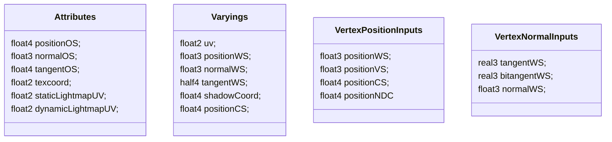
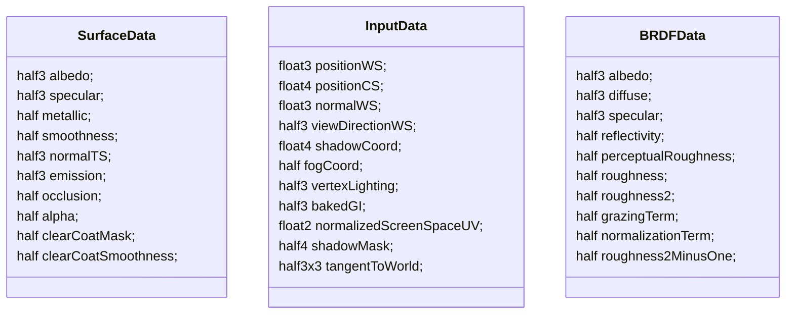
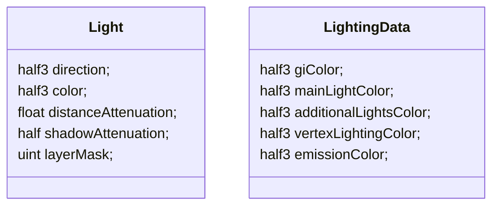

# URP Lighting








```c
// LitForwardPass.hlsl

Varyings LitPassVertex(Attributes input)
{
    VertexPositionInputs vertexInput = GetVertexPositionInputs(input.positionOS.xyz); // 转换空间，ndc坐标并未执行透视除法
    VertexNormalInputs normalInput = GetVertexNormalInputs(input.normalOS, input.tangentOS);
    
    output.uv = TRANSFORM_TEX(input.texcoord, _BaseMap);
    output.normalWS = normalInput.normalWS;
    output.positionWS = vertexInput.positionWS;
    
    // 获取shadodwCoord
    // cascade index计算
    // 获取Matrix
    // 执行转换
    output.shadowCoord = GetShadowCoord(vertexInput); 
    
    output.positionCS = vertexInput.positionCS;
}

```

```c
// LitForwardPass.hlsl

void LitPassFragment(Varyings input, out half4 outColor : SV_Target0)
{
    // 采样贴图得到各种表面得属性
    // albedo
    // metallic, smooth
    // normal
    // occlusion
    // emission
    // detailUv
    SurfaceData surfaceData;
    InitializeStandardLitSurfaceData(input.uv, surfaceData);
    
   	// 在两个lod之间平滑过渡
    LODFadeCrossFade(input.positionCS);
    
    // 基本上是把Varyings的值拷贝到InputData中
    // 计算了tangentToWorld矩阵
    // 为每个fragment计算shadowCoord
    //  采样贴图得到shadowmask,bakedGI
    //  LitForwardPass.hlsl
    InputData inputData;
    InitializeInputData(input, surfaceData.normalTS, inputData); 
    
    half4 color = UniversalFragmentPBR(inputData, surfaceData);
    outColor = color;
}
```

```c
// brdf.hlsl
inline void InitializeBRDFData(half3 albedo, half metallic, half3 specular, half smoothness, inout half alpha, out BRDFData outBRDFData)
{
    half oneMinusReflectivity = OneMinusReflectivityMetallic(metallic); // 物体不反射的属性
    half reflectivity = half(1.0) - oneMinusReflectivity; // 反射的属性
    
    half3 brdfDiffuse = albedo * oneMinusReflectivity; 
    half3 brdfSpecular = lerp(kDieletricSpec.rgb, albedo, metallic); //F0
}

// bakedGI是从lightmap中或者probe中获得的值
half3 SubtractDirectMainLightFromLightmap(Light mainLight, half3 normalWS, half3 bakedGI)
{
    half shadowStrength = GetMainLightShadowStrength(); // 光的阴影强度属性
    half contributionTerm = saturate(dot(mainLight.direction, normalWS));
    half3 lambert = mainLight.color * contributionTerm; // color * cos
    half3 estimatedLightContributionMaskedByInverseOfShadow = lambert * (1.0 - mainLight.shadowAttenuation); // 阴影对光的衰减
    half3 subtractedLightmap = bakedGI - estimatedLightContributionMaskedByInverseOfShadow;// 从烘焙中减去主光源的贡献

    // 2) Allows user to define overall ambient of the scene and control situation when realtime shadow becomes too dark.
    half3 realtimeShadow = max(subtractedLightmap, _SubtractiveShadowColor.xyz);
    realtimeShadow = lerp(bakedGI, realtimeShadow, shadowStrength);

    // 3) Pick darkest color
    return min(bakedGI, realtimeShadow);
}

// GlobalIllumination.hlsl
void MixRealtimeAndBakedGI(inout Light light, half3 normalWS, inout half3 bakedGI)
{
    bakedGI = SubtractDirectMainLightFromLightmap(light, normalWS, bakedGI);
}

// GlobalIllumination.hlsl
half3 CalculateIrradianceFromReflectionProbes(half3 reflectVector, float3 positionWS, half perceptualRoughness, float2 normalizedScreenSpaceUV)
{
    
}

// GlobalIllumination.hlsl
half3 GlossyEnvironmentReflection(half3 reflectVector, float3 positionWS, half perceptualRoughness, half occlusion, float2 normalizedScreenSpaceUV)
{
    
}

// GlobalIllumination.hlsl
half3 GlobalIllumination(BRDFData brdfData, BRDFData brdfDataClearCoat, float clearCoatMask,
    half3 bakedGI, half occlusion, float3 positionWS,
    half3 normalWS, half3 viewDirectionWS, float2 normalizedScreenSpaceUV)
{
    half3 reflectVector = reflect(-viewDirectionWS, normalWS);
    half NoV = saturate(dot(normalWS, viewDirectionWS));
    half fresnelTerm = Pow4(1.0 - NoV);
    
    half3 indirectDiffuse = bakedGI;
    // 采样反射探针和天空盒
     half3 indirectSpecular = GlossyEnvironmentReflection(reflectVector, positionWS, brdfData.perceptualRoughness, 1.0h, normalizedScreenSpaceUV);
    
   half3 color = EnvironmentBRDF(brdfData, indirectDiffuse, indirectSpecular, fresnelTerm);
    
   return color * occlusion;
}

half3 LightingPhysicallyBased(BRDFData brdfData, BRDFData brdfDataClearCoat,
    half3 lightColor, half3 lightDirectionWS, half lightAttenuation,
    half3 normalWS, half3 viewDirectionWS,
    half clearCoatMask, bool specularHighlightsOff)
{
    // Li * (diffuse + sepcular) * cos
}

// Lighting.hlsl
half4 UniversalFragmentPBR(InputData inputData, SurfaceData surfaceData)
{
    // 初始化brdf
    // albedo、brdf的漫反射项diffuse, brdf的镜面反射项specular(F0)
    // 物体的反射率reflectivity
    // 从smoothness计算出roughness
    // grazingTerm
    InitializeBRDFData(surfaceData, brdfData);
    
    BRDFData brdfDataClearCoat = CreateClearCoatBRDFData(surfaceData, brdfData);
    
    // 确定shadow是从shadowmask中还是从probes中来
    half4 shadowMask = CalculateShadowMask(inputData);
    
    // 获取方向光信息
    // direction和color
    Light mainLight = GetMainLight(inputData, shadowMask, aoFactor);
    {
        // realtime shadow 采样阴影贴图(软硬阴影)
        // bakedShadow 
        // 
        light.shadowAttenuation = MainLightShadow(shadowCoord, positionWS, shadowMask, _MainLightOcclusionProbes);
    }
    
    MixRealtimeAndBakedGI(mainLight, inputData.normalWS, inputData.bakedGI);

    // 烘焙光
    LightingData lightingData = CreateLightingData(inputData, surfaceData);
    lightingData.giColor = GlobalIllumination(brdfData, brdfDataClearCoat, surfaceData.clearCoatMask,
                                              inputData.bakedGI, aoFactor.indirectAmbientOcclusion, inputData.positionWS,
                                              inputData.normalWS, inputData.viewDirectionWS, inputData.normalizedScreenSpaceUV); 
    
    // mainLightColor的计算
    lightingData.mainLightColor = LightingPhysicallyBased(brdfData, brdfDataClearCoat,
                                                          mainLight,
                                                          inputData.normalWS, inputData.viewDirectionWS,
                                                          surfaceData.clearCoatMask, specularHighlightsOff);
    
    // 其他光源的计算
    lightingData.additionalLightsColor += LightingPhysicallyBased(brdfData, brdfDataClearCoat, light,
                                                                          inputData.normalWS, inputData.viewDirectionWS,
                                                                          surfaceData.clearCoatMask, specularHighlightsOff);
    
}


```

